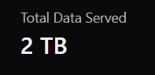
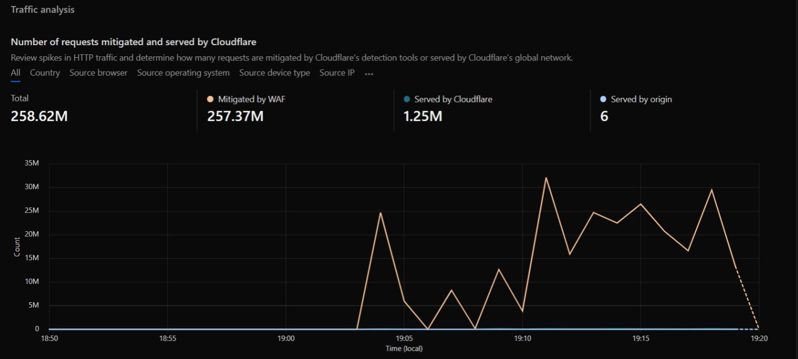
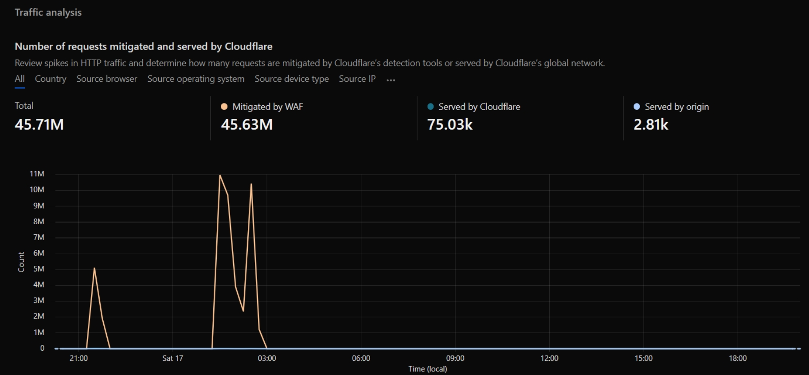
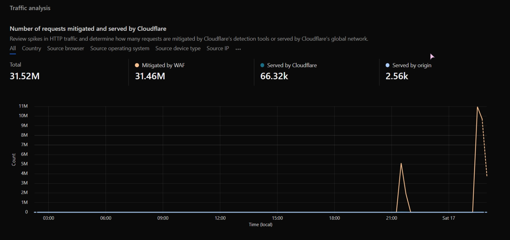
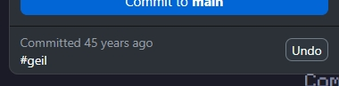

     
    <h2>I'm a developer</h2>

There is not much public content here, hopefully, that’ll change, but most of my current repositories contain private exploits and other stuff I’m not allowed to reveal.

You might know me from random stuff I do.

<h2 align="center">💜 〣 Infos about me </h2>

- 📈 [Contact 〣 cuzimstupi4. (Discord)](https://discord.gg/1349476964024451162)
- 📧 [Send me an Email 〣 admin@cuzimstupi4.eu](mailto:admin@cuzimstupi4.eu)
- ❤️ 17 years old

<h2 align="center">💻 〣 Discord Status</h2>

old and lost discord account

<h2 align="center">🏆 〣 GitHub Trophies </h2>

  

<h2 align="center">💻 〣 My favorite tools and technologies </h2>

  <table align="center">
    <tr>
      <td align="center" width="96">
        
         React
      </td>
      <td align="center" width="96">
        
         Lua
      </td>
      <td align="center" width="96">
        
         Python
      </td>
      <td align="center" width="96">
        
         Java
      </td>
      <td align="center" width="96">
        
         JavaScript
      </td>
      <td align="center" width="96">
        
         C++
      </td>
      <td align="center" width="96">
        
         C Sharp
      </td>
      <td align="center" width="96">
        
         Webpack
      </td>
      <td align="center" width="96">
        
         MySQL
      </td>
      <td align="center" width="96">
        
         TypeScript
      </td>
    </tr>
    <tr>
      <td align="center" width="96">
        
         Github
      </td>
      <td align="center" width="96">
        
         Git
      </td>
      <td align="center" width="96">
        
         GitKraken
      </td>
      <td align="center" width="96">
        
         Prettier
      </td>
      <td align="center" width="96">
        
         HTML5
      </td>
      <td align="center" width="96">
        
         CSS
      </td>
      <td align="center" width="96">
        
         Tailwind
      </td>
      <td align="center" width="96">
        
         jQuery
      </td>
    </tr>
    <tr>
      <td align="center" width="96">
        
         MongoDB
      </td>
      <td align="center" width="96">
        
         Node.js
      </td>
      <td align="center" width="96">
        
         Nginx
      </td>
      <td align="center" width="96">
        
         VSCode
      </td>
      <td align="center" width="96">
        
         Docker
      </td>
    </tr>
  </table>

<h2 align="center">⚙️ 〣 Security of Websites</h2>

  I enjoy securing websites using Cloudflare. WAF feel free to test your Layer 4 (L4) tool here, if you manage to get more than <strong>260 million</strong> requests, your result will be posted here as well!
  <a href="https://sunv.love" target="_blank">sunv.love</a>
    

  

<table>
  <tr>
    <td align="center"></td>
    <td align="center"></td>
  </tr>
</table>

<h2 align="center">🎁 〣 GitHub Stats</h2>
<!-- 

  

 -->

  

<h2 align="center">🤔 〣 How Did I Travel Back to 1970 in Git?</h2>

  Curious about my journey to 1970 in Git's timeline? Check out my repository 
  <a href="https://github.com/CuzImStupi4/lolll">lolll</a>, where I was able to make a script that automates commits across various years, reaching as far back as 1970. 
  This exploits a bug (or an feature) in Git that allows altering commit timestamps. Using commands like:

<pre>
<code>git commit --date="Tue Jan 2 23:00:00 2006 +0300" -m "Changing date back to 2006"</code>
</pre>

  I was able to manipulate commit dates.
  View the repo for more details!

